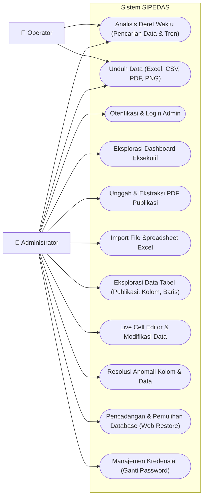
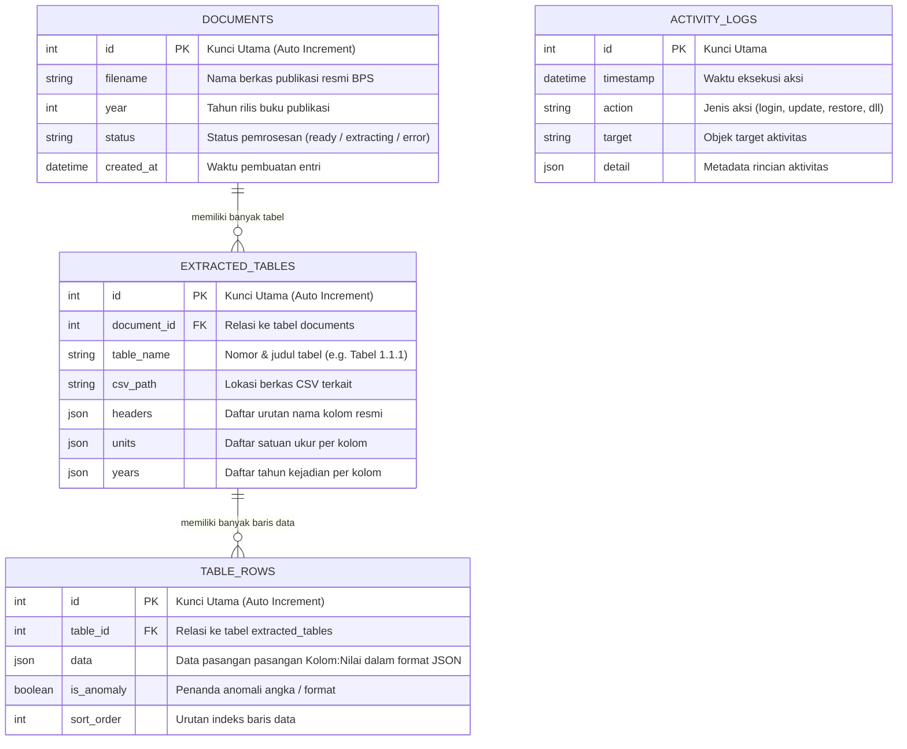
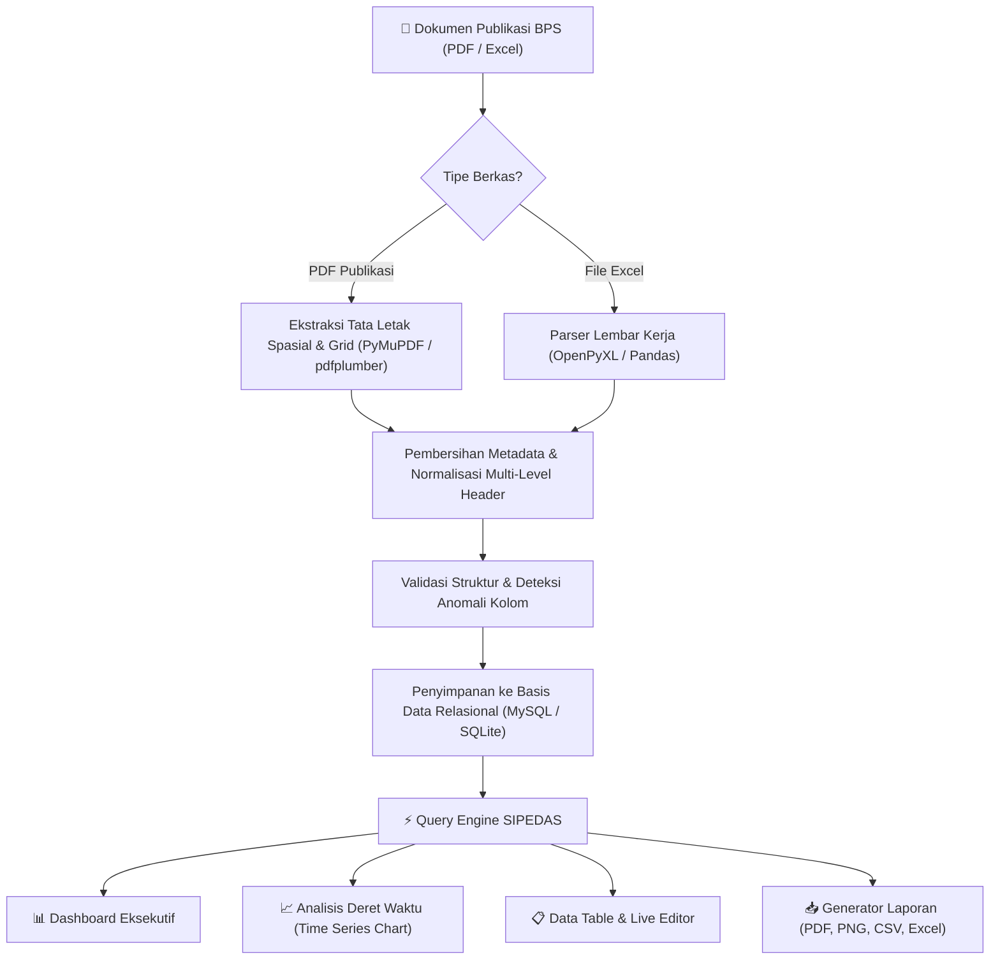
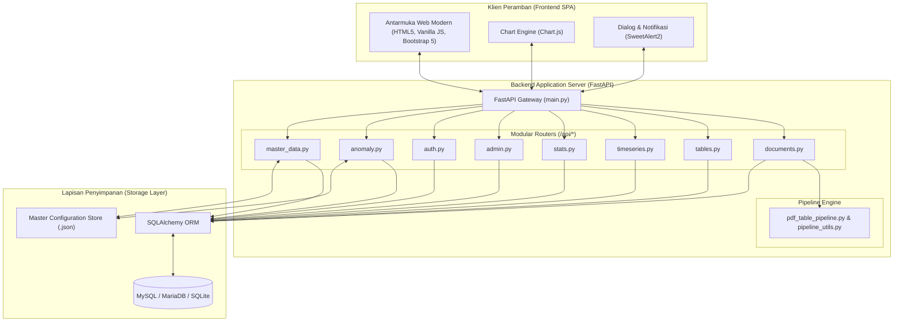

<div align="center">

<p align="center">
  
  
</p>

# SIPEDAS
### **Sistem Integrasi, Pencarian, dan Analisis Data Statistik**
**Badan Pusat Statistik Kabupaten Tasikmalaya**

<p align="center">
  
  
  
  
  
  
</p>

<p align="center">
  <em>Platform terpadu digitalisasi, ekstraksi cerdas, dan analisis deret waktu (time series) multi-tahun publikasi data statistik resmi Badan Pusat Statistik Kabupaten Tasikmalaya.</em>
</p>

</div>

---

## 📑 Navigasi Dokumentasi

| Kategori | Modul & Panduan | Deskripsi Ringkas |
| :--- | :--- | :--- |
| **Pengenalan** | [📖 Tentang SIPEDAS](#-tentang-sipedas)<br>[🚀 Fitur Utama](#-fitur-fitur-utama) | Latar belakang, tujuan, dan 8 modul utama sistem |
| **Arsitektur & Diagram** | [1. Use Case Diagram](#1-diagram-use-case)<br>[2. Entity Relationship (ERD)](#2-diagram-relasi-entitas-erd)<br>[3. Alur Ekstraksi Data](#3-diagram-alur-ekstraksi-data-data-pipeline)<br>[4. Arsitektur Sistem](#4-diagram-arsitektur-sistem) | Diagram teknis alur kerja, skema database & hak akses peran |
| **Teknologi** | [🛠️ Tech Stack](#-spesifikasi-teknologi-tech-stack) | Rincian spesifikasi backend, frontend & pustaka ekstraksi |
| **Panduan Instalasi** | [💻 Panduan Instalasi (Clone Guide)](#-panduan-instalasi--menjalankan-sistem-clone-guide)<br>&bull; [Prasyarat Sistem](#a-prasyarat-sistem)<br>&bull; [Langkah Instalasi Cepat](#b-langkah-instalasi-cepat)<br>&bull; [Konfigurasi Database](#c-opsi-konfigurasi-basis-data)<br>&bull; [Menjalankan Server](#d-menjalankan-server) | Panduan langkah demi langkah menjalankan sistem dari nol |
| **Referensi Teknis** | [🔌 Dokumentasi REST API](#-dokumentasi-rest-api)<br>[🛠️ Panduan Troubleshooting](#-panduan-troubleshooting)<br>[🗺️ Roadmap Pengembangan](#-roadmap-pengembangan-masa-depan)<br>[📁 Struktur Direktori](#-struktur-direktori-proyek) | Endpoint Swagger, solusi kendala & peta pohon berkas |
| **Legalitas** | [📄 Hak Cipta & Lisensi](#-hak-cipta--lisensi-resmi) | Lisensi resmi BPS Kabupaten Tasikmalaya |

---

## 📖 Tentang SIPEDAS

Publikasi data statistik berkala resmi, seperti buku **Kabupaten Dalam Angka (DDA)**, diterbitkan dalam bentuk dokumen buku PDF berukuran besar yang memuat ratusan hingga ribuan tabel statistik. Format dokumen statis ini menghadirkan beberapa tantangan nyata:
- **Sulit Dicari**: Membutuhkan waktu untuk menemukan indikator statistik tertentu di antara ribuan halaman.
- **Tidak Terintegrasi Lintas Tahun**: Sulit membandingkan perkembangan angka dan tren deret waktu (*time series*) antar edisi publikasi.
- **Format Statis**: Data tidak dapat langsung diolah atau diekspor ke dalam format analitik visual.

**SIPEDAS (Sistem Integrasi, Pencarian, dan Analisis Data Statistik)** hadir sebagai solusi komprehensif yang mentransformasi buku PDF publikasi BPS menjadi basis data relasional dinamis. Sistem ini memungkinkan pencarian indikator secara instan, perbandingan tren multi-tahun, pembuatan grafik otomatis, serta pelaporan data yang fleksibel dan aman.

---

## 🚀 Fitur-Fitur Utama

* **📊 Dashboard Eksekutif Interaktif**: Ringkasan akumulasi data statistik secara langsung, visualisasi sebaran tabel per bab publikasi, dan indikator pemantauan status basis data.
* **📄 Ekstraksi PDF Cerdas (AI Spatial Grid Parser)**: Ekstraksi otomatis nomor tabel, judul publikasi, satuan unit, dan *multi-level header* menggunakan integrasi PyMuPDF & pdfplumber.
* **📑 Sinkronisasi & Parser Excel**: Dukungan impor berkas lembar kerja spreadsheet Excel (`.xlsx` / `.xls`) langsung ke dalam basis data relasional.
* **📋 Data Table Explorer & Live Cell Editor**: Penelusuran data tabel per bab/kategori, pencarian cepat pada tingkat kolom maupun baris, serta fitur pengeditan sel nilai data langsung di browser.
* **📈 Modul Analisis Deret Waktu (Time Series Engine)**: Pelacakan tren statistik lintas tahun secara dinamis, penyaringan indikator tunggal/gabungan, visualisasi grafik garis & batang interaktif, serta ekspor laporan kustom (PDF Laporan, PNG Grafik, CSV, dan Excel).
* **🔍 Deteksi & Resolusi Anomali Data**: Pemindaian otomatis anomali nama kolom bilingual / duplikat serta koreksi inkonsistensi struktur tabel secara massal.
* **🗄️ Manajemen Database & Restore Web**: Pencadangan basis data otomatis (`.sql`), pemulihan data instan langsung melalui antarmuka web, serta kompatibilitas multi-database (MySQL / SQLite).
* **🔒 Keamanan Administrator Berstandar**: Enkripsi password menggunakan algoritma **PBKDF2-HMAC-SHA256** dengan *Salt* acak, proteksi pembatasan percobaan gagal (*Anti-Brute Force Lockout* 5 menit), form penggantian password admin interaktif dengan toggle *Show/Hide Password* (👁️), dan pencatatan audit log aktivitas.

---

## 📊 Diagram Sistem

### 1. Diagram Use Case
Diagram ini menggambarkan pembagian peran dan batasan hak akses antara **Operator** dan **Administrator**:



* **Operator**: Mengakses menu utama **Analisis Deret Waktu (Time Series)** untuk mencari indikator data statistik, melihat grafik tren multi-tahun, serta melakukan ekspor data (Excel, CSV, PDF, PNG).
* **Administrator**: Memiliki seluruh akses Operator ditambah akses penuh ke Dashboard Eksekutif, ekstraksi PDF baru, import Excel, penelusuran Data Tabel & live editor sel data, resolusi anomali, manajemen backup/restore database, serta ganti password admin.

---

### 2. Diagram Relasi Entitas (ERD)
Skema struktur data relasional yang mendasari penyimpanan dokumen publikasi, tabel, baris nilai data, dan log audit di SIPEDAS:



---

### 3. Diagram Alur Ekstraksi Data (Data Pipeline)
Alur pemrosesan dari dokumen mentah (PDF/Excel) hingga siap disajikan ke dalam visualisasi analitik interaktif:



---

### 4. Diagram Arsitektur Sistem
Struktur lapisan arsitektur modular yang memisahkan antara Presentation Layer, Application Business Logic, Data Storage, dan Export Engine:



---

## 🛠️ Spesifikasi Teknologi (Tech Stack)

| Komponen | Teknologi yang Digunakan | Keterangan |
| :--- | :--- | :--- |
| **Backend Framework** | **Python 3.10+ & FastAPI** | Performa asinkron tinggi dengan standar OpenAPI otomatis |
| **Server Gateway** | **Uvicorn (ASGI)** | Server web berkecepatan tinggi berbasis uvloop |
| **ORM & Database** | **SQLAlchemy 2.0+** | Abstraksi relasional database-agnostic (MySQL & SQLite) |
| **Data Processing** | **Pandas & OpenPyXL** | Manipulasi matriks tabel dan pemrosesan berkas spreadsheet |
| **PDF Extraction** | **PyMuPDF (fitz) & pdfplumber** | Ekstraksi teks berbasis koordinat batas grid dan pembacaan tabel |
| **Frontend UI** | **Vanilla JavaScript (SPA Architecture)** | Responsif, tanpa dependensi build tools yang rumit |
| **Styling & Icons** | **Bootstrap 5.3 & Bootstrap Icons** | Tata letak modern yang bersih dengan dukungan Dark Mode |
| **Data Visualization** | **Chart.js** | Visualisasi tren deret waktu (Line & Bar charts) |
| **Security & Auth** | **PBKDF2-HMAC-SHA256** | Hashing kredensial dengan Salt acak dan proteksi anti-brute force |

---

## 💻 Panduan Instalasi & Menjalankan Sistem (Clone Guide)

Ikuti langkah-langkah mudah berikut untuk meng-clone dan menjalankan sistem SIPEDAS di komputer lokal dari awal:

### A. Prasyarat Sistem
Pastikan perangkat Anda telah terpasang:
1. **Python** versi `3.10`, `3.11`, atau `3.12` ([Unduh Python](https://www.python.org/downloads/)). *Pastikan mencentang pilihan "Add Python to PATH" saat instalasi.*
2. **Git** ([Unduh Git](https://git-scm.com/)).
3. *(Opsional)* **XAMPP / MySQL** ([Unduh XAMPP](https://www.apachefriends.org/)) jika ingin menggunakan database MySQL lokal.

---

### B. Langkah Instalasi Cepat

1. **Clone Repository GitHub**:
   ```bash
   git clone https://github.com/supyan1403/project_bps_tasik.git
   cd project_bps_tasik
   ```

2. **Buat Virtual Environment (venv)**:
   ```bash
   python -m venv venv
   ```

3. **Aktifkan Virtual Environment**:
   - **Windows (Command Prompt / PowerShell)**:
     ```cmd
     venv\Scripts\activate
     ```
   - **Linux / macOS**:
     ```bash
     source venv/bin/activate
     ```

4. **Instal Seluruh Dependensi Proyek**:
   ```bash
   pip install -r requirements.txt
   ```

---

### C. Opsi Konfigurasi Basis Data

SIPEDAS mendukung dua mode basis data yang sangat fleksibel:

#### 🔹 Opsi 1: Menggunakan MySQL XAMPP (Mode Default)
1. Buka **XAMPP Control Panel**, lalu klik **Start** pada modul **Apache** dan **MySQL**.
2. Buka peramban ke `http://localhost/phpmyadmin`.
3. Buat basis data baru bernama: `bps_tasikmalaya`.

#### 🔹 Opsi 2: Tanpa XAMPP (Mode SQLite Mandiri / Portabel)
Jika Anda tidak memiliki XAMPP atau ingin menjalankan sistem secara instan, setel variabel lingkungan sebelum menjalankan server:
- **Windows (PowerShell)**:
  ```powershell
  $env:DATABASE_URL="sqlite:///./bps_dashboard.db"
  ```
- **Windows (Command Prompt)**:
  ```cmd
  set DATABASE_URL=sqlite:///./bps_dashboard.db
  ```
- **Linux / macOS**:
  ```bash
  export DATABASE_URL="sqlite:///./bps_dashboard.db"
  ```

---

### D. Menjalankan Server

Terdapat dua cara praktis untuk menyalakan aplikasi:

* **Cara 1: Menggunakan Runner Otomatis (Direkomendasikan di Windows)**
  Cukup klik dua kali berkas:
  ```text
  start.bat
  ```
  *(Skrip ini otomatis membebaskan port yang bentrok dan menyalakan server).*

* **Cara 2: Melalui Terminal Manual**
  ```bash
  python backend/run_server.py
  ```

Setelah server aktif, buka peramban dan akses alamat:
👉 **`http://127.0.0.1:8000`**

---

### E. Memulai & Mengisi Data

Saat pertama kali dibuka, Anda dapat langsung mulai mengisi data dengan mudah:

1. **Mulai dari Nol (Unggah Dokumen Baru)**:
   - Klik **Login Admin** di pojok kiri bawah.
   - Buka menu **Data Tabel ➔ Tambah Publikasi Baru** untuk mengekstrak berkas PDF resmi BPS.
   - Atau gunakan menu **Import Excel** untuk memasukkan tabel data dari file spreadsheet.

2. **Memulihkan dari File Cadangan Database (`.sql`)**:
   - Jika Anda memiliki berkas backup `.sql`, login sebagai Administrator.
   - Buka menu **Manajemen Database ➔ Backup Database**.
   - Pada panel **"Unggah Berkas Backup (.sql)"**, pilih berkas `.sql` cadangan Anda dan klik tombol **"Unggah & Pulihkan"**.
   - Sistem akan memproses impor data secara otomatis dan seluruh data statistik akan langsung tampil lengkap di web!

---

## 🔌 Dokumentasi REST API

FastAPI menyediakan dokumentasi antarmuka pemrograman aplikasi (API) interaktif secara bawaan. Saat server berjalan, Anda dapat menjelajahi dan menguji seluruh endpoint di:

* **Swagger UI Interaktif**: `http://127.0.0.1:8000/docs`
* **ReDoc Dokumentasi**: `http://127.0.0.1:8000/redoc`

### Ringkasan Router Endpoint:
| Endpoint Prefix | Modul Router | Fungsi Utama |
| :--- | :--- | :--- |
| `/api/documents` | `documents.py` | Manajemen dokumen publikasi dan pemicu ekstraksi PDF |
| `/api/tables` | `tables.py` | Penelusuran tabel, pencarian data, dan live cell editor |
| `/api/timeseries` | `timeseries.py` | Agregasi data deret waktu multi-tahun & generator grafik |
| `/api/stats` | `stats.py` | KPI agregat statistik untuk kartu metrik dashboard |
| `/api/master-data` | `master_data.py` | Standarisasi master kolom dan kamus indikator |
| `/api/anomaly` | `anomaly.py` | Deteksi dan resolusi anomali struktur kolom |
| `/api/admin` | `admin.py` | Pencadangan basis data, pemulihan (restore), dan activity log |
| `/api/auth` | `auth.py` | Otentikasi admin, verifikasi sesi, dan penggantian password |

---

## 🛠️ Panduan Troubleshooting

| Gejala Kendala | Kemungkinan Penyebab | Solusi Penanganan |
| :--- | :--- | :--- |
| **Error: Address already in use (Port 8000)** | Ada proses Python atau server lain yang belum berhenti di port 8000. | Jalankan berkas `start.bat` yang otomatis membersihkan port, atau matikan proses manual lewat Task Manager. |
| **Error: Can't connect to MySQL server (10061)** | Layanan MySQL di XAMPP belum menyala atau port berbeda. | Buka XAMPP Control Panel dan pastikan modul MySQL berstatus **Running** (hijau), atau gunakan [Mode SQLite](#-opsi-2-tanpa-xampp-mode-sqlite-mandiri--portabel). |
| **Ekstraksi PDF tidak membaca angka tabel** | Berkas PDF merupakan hasil scan gambar murni, bukan format vektor teks digital resmi BPS. | Pastikan menggunakan berkas PDF resmi BPS yang teksnya dapat diseleksi/disalin secara langsung. |
| **Lupa Password Admin** | Belum mengatur ulang kredensial awal. | Hubungi pengelola teknis sistem untuk mereset berkas konfigurasi otentikasi di `backend/data/auth_credentials.json`. |

---

## 🗺️ Roadmap Pengembangan Masa Depan

* [ ] **Integrasi OCR AI (Optical Character Recognition)** untuk ekstraksi publikasi arsip cetak lama yang berupa pemindaian dokumen fisik.
* [ ] **Peta Tematik Spasial GIS (Geographic Information System)** untuk pemetaan indikator statistik per wilayah kecamatan di Kabupaten Tasikmalaya.
* [ ] **Integrasi API Terbuka Satu Data Indonesia (SDI)** untuk standardisasi pertukaran data lintas instansi pemerintah daerah.
* [ ] **Modul Prediksi Tren Statistik Lanjutan** menggunakan algoritma peramalan deret waktu (*time series forecasting*).

---

## 📁 Struktur Direktori Proyek

```text
project_bps_tasik/
│
├── start.bat                   # Skrip otomatis runner server (Windows)
├── requirements.txt            # Daftar dependensi paket Python
├── README.md                   # Dokumentasi resmi sistem
├── table_mods.json             # Konfigurasi penggabungan tabel PDF multi-halaman
│
├── pipeline/                   # Pipeline inti pemrosesan & ekstraksi dokumen
│   ├── __init__.py
│   ├── pdf_table_pipeline.py   # Ekstraktor tabel PDF cerdas (PyMuPDF & pdfplumber)
│   ├── pipeline_utils.py       # Utilitas pembersihan teks, header & kamus istilah
│   └── extract_toc.py          # Ekstraktor daftar isi & struktur bab publikasi
│
├── backups/                    # Direktori penyimpanan file cadangan database (.sql)
│
└── backend/                    # Core backend server (FastAPI)
    ├── main.py                 # Titik masuk utama aplikasi & konfigurasi FastAPI
    ├── database.py             # Konfigurasi koneksi SQLAlchemy ORM
    ├── models.py               # Definisi skema tabel basis data relasional
    ├── schemas.py              # Skema validasi request/response Pydantic
    ├── run_server.py           # Runner server backend
    │
    ├── routers/                # Modul router endpoint API terpisah
    │   ├── admin.py            # Manajemen backup, restore & activity logs
    │   ├── anomaly.py          # Deteksi & resolusi anomali kolom
    │   ├── auth.py             # Otentikasi admin, PBKDF2 hash & lockout
    │   ├── documents.py        # Pengelolaan dokumen & ekstraksi PDF
    │   ├── master_data.py      # Master kamus kolom statistik
    │   ├── stats.py            # KPI & metrik agregasi dashboard
    │   ├── tables.py           # Penelusuran data tabel & live editor
    │   └── timeseries.py       # Analisis deret waktu multi-tahun
    │
    ├── data/                   # Berkas konfigurasi data JSON & kredensial
    │   ├── auth_credentials.json
    │   ├── master_columns.json
    │   └── master_dictionary.json
    │
    ├── scripts/                # Skrip CLI utilitas & migrasi data
    │   ├── table_merger.py
    │   └── post_extract_merge.py
    │
    ├── static/                 # Aset web statis (Frontend)
    │   ├── app.js              # Logika utama aplikasi Single Page Application
    │   ├── auth_role_logic.js  # Logika otentikasi & dialog ganti password
    │   ├── logo_bps.svg        # Logo resmi Badan Pusat Statistik
    │   ├── logo_sipedas.svg    # Logo sistem SIPEDAS
    │   └── css/                # Modul stylesheet CSS terstruktur
    │       ├── base.css
    │       ├── layout.css
    │       ├── components.css
    │       └── ...
    │
    └── templates/              # Antarmuka template HTML
        └── index.html          # Halaman utama aplikasi SIPEDAS
```

---

## 📄 Hak Cipta & Lisensi Resmi

Hak Cipta © 2026 **Badan Pusat Statistik Kabupaten Tasikmalaya**. Seluruh hak cipta dilindungi undang-undang.

Aplikasi ini dikembangkan untuk mendukung kegiatan pengumpulan, pengolahan, integrasi, digitalisasi, dan diseminasi data statistik resmi di lingkungan **Badan Pusat Statistik Kabupaten Tasikmalaya**.
